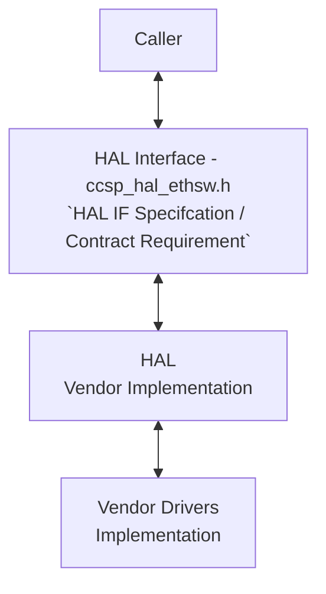
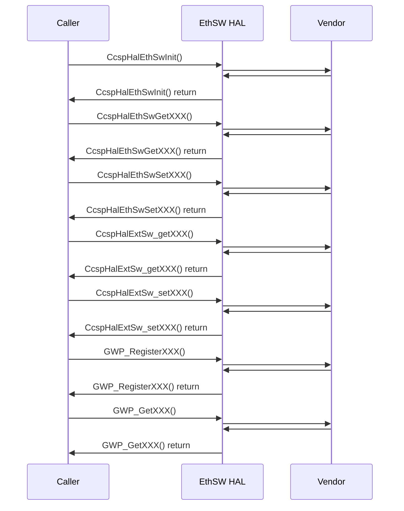

# ETHSW HAL Documentation

## Acronyms

- `HAL` \- Hardware Abstraction Layer
- `RDK-B` \- Reference Design Kit Broadband
- `ETHSW` \- Ethernet Switch
- `WAN` \- Wide Area Network
- `LAN` \- Local Area Network
- `VLAN` \- Virtual Local Area Network
- `IP` \- Internet Protocol
- `DHCP` \- Dynamic Host Configuration Protocol
- `MAC` \- Media Access Control
- `QoS` \- Quality of Service
- `DSCP` \- Differentiated Services Code Point
- `ACL` \- Access Control List
- `IGMP` \- Internet Group Management Protocol
- `MLD` \- Multicast Listener Discovery
- `STP` \- Spanning Tree Protocol
- `MIB` \- Management Information Base
- `CLI` \- Command Line Interface
- `JSON` \- JavaScript Object Notation
- `TR-181` \- Technical Report 181 (CPE WAN Mgmt Protocol)
- `OMCI` \- Optical Network Terminal Management Interface

## Description

The Ethernet Switch Hardware Abstraction Layer (HAL) module, also known as ccsp_hal_ethsw, provides a standardized interface for managing and configuring Ethernet switches in the Reference Design Kit Broadband (RDK-B) ecosystem. It serves as a bridge between the RDK-B software stack and the underlying Ethernet switch hardware, enabling consistent configuration and control across various switch implementations.

### Key Functions

**Port Management**: Control of Ethernet port states (enable/disable), speed, and duplex settings.

**VLAN Configuration**: Creation, deletion, and modification of Virtual LANs (VLANs) to segment network traffic.

**QoS (Quality of Service)**: Implementation and management of QoS policies to prioritize different types of network traffic.

**Security**: Configuration of access control lists (ACLs) to filter traffic and enhance network security.

**Multicast Control**: Management of IGMP (Internet Group Management Protocol) and MLD (Multicast Listener Discovery) to enable multicast functionality.

**Diagnostics**: Retrieval of Ethernet switch statistics and information for troubleshooting purposes.
Benefits:

**Abstraction**: Simplifies the interaction with Ethernet switches by providing a consistent API regardless of the underlying hardware.

**Modularity**: Allows for easy integration of new Ethernet switch hardware into the RDK-B platform.

**Flexibility**: Supports a wide range of Ethernet switch features and configurations.

**Reliability**: Ensures stable and predictable Ethernet switch behavior across different RDK-B devices.

**Standardization**: Promotes interoperability between different RDK-B components and applications.

**TR-181 Data Model**: Aligns with the TR-181 data model, a widely used standard for CPE (Customer Premises Equipment) management.

This module is essential for RDK-B devices that incorporate Ethernet switches, such as home gateways and routers. It enables software developers to easily manage and control Ethernet switch functionality without needing to understand the specifics of the underlying hardware.

The diagram below describes a high-level software architecture of the EthSW HAL module stack.



## Component Runtime Execution Requirements

### Initialization and Startup

The EthSW HAL (Ethernet Switch Hardware Abstraction Layer) client module should call the following initialization API **once** during bootup, before invoking any other dependent APIs.

- `CcspHalEthSwInit()`: This function initializes the EthSW HAL, setting up necessary data structures, starting threads, and ensuring the underlying hardware is ready for operation.
Important Note:

- **Mandatory Initialization**: The `CcspHalEthSwInit()` function must be called before using any other EthSW HAL API.
- **Blocking Behavior**: This function may block execution if the underlying Ethernet switch hardware is not ready. This ensures a robust initialization process and prevents errors due to premature interaction with the hardware.
- **Vendor Implementation**: Third-party vendors should implement this API according to their specific operational requirements, taking into account the potential blocking behavior.

## Threading Model

EthSW HAL is not thread safe, any module which is invoking the EthSW HAL api should ensure calls are made in a thread safe manner.

Vendors may implement internal threading and event mechanisms to meet their operational requirements. These mechanisms must be designed to ensure thread safety when interacting with HAL interface. Proper cleanup of allocated resources (e.g., memory, file handles, threads) is mandatory when the vendor software terminates or closes its connection to the HAL.

## Process Model

All API's are expected to be called from multiple process.

## Memory Model

**Caller Responsibilities**:

- Manage memory passed to specific functions as outlined in the API documentation. This includes allocation and deallocation to prevent leaks.

**Module Responsibilities**:

- Handle and deallocate memory used for its internal operations.
- Release all internally allocated memory upon closure to prevent leaks.

TODO:
State a footprint requirement. Example: This should not exceed XXXX KB.

## Power Management Requirements

The EthSW HAL is not involved in any of the power management operation.

## Asynchronous Notification Model

There are no asynchronous notifications.

## Blocking calls

**Synchronous and Responsive**: All APIs within this module should operate synchronously and complete within a reasonable timeframe based on the complexity of the operation. Specific timeout values or guidelines may be documented for individual API calls.

**Timeout Handling**: To ensure resilience in cases of unresponsiveness, implement appropriate timeouts for API calls where failure due to lack of response is a possibility. Refer to the API documentation for recommended timeout values per function.

**Non-Blocking Requirement**: Given the single-threaded environment in which these APIs will be called, it is imperative that they do not block or suspend execution of the main thread. Implementations must avoid long-running operations or utilize asynchronous mechanisms where necessary to maintain responsiveness.

TODO:

- Define API Timeout Requirements:
  - For each EthSW HAL API, specify an appropriate timeout value based on the expected operation time and potential
    failure scenarios.
  - Consider factors like network latency, hardware response times, and the complexity of the operation.
  - If applicable, reference relevant specifications or industry standards for guidance on timeout durations.
  - Document the default timeout values for each API clearly within the header file or accompanying documentation.

## Internal Error Handling

**Synchronous Error Handling**: All APIs must return errors synchronously as a return value. This ensures immediate notification of errors to the caller.

**Internal Error Reporting**: The HAL is responsible for reporting any internal system errors (e.g., out-of-memory conditions) through the return value.

**Focus on Logging for Errors**: For system errors, the HAL should prioritize logging the error details for further investigation and resolution.

## Persistence Model

There is no requirement for HAL to persist any setting information.

## Nonfunctional requirements

Following non functional requirement should be supported by the EthSW HAL component.

## Logging and debugging requirements

The component is required to record all errors and critical informative messages to aid in identifying, debugging, and understanding the functional flow of the system. Logging should be implemented using the syslog method, as it provides robust logging capabilities suited for system-level software. The use of `printf` is discouraged unless `syslog` is not available.

All HAL components must adhere to a consistent logging process. When logging is necessary, it should be performed into the `ethsw_vendor_hal.log` file, which is located in either the `/var/tmp/` or `/rdklogs/logs/` directories.

Logs must be categorized according to the following log levels, as defined by the Linux standard logging system, listed here in descending order of severity:

- **FATAL**: Critical conditions, typically indicating system crashes or severe failures that require immediate attention.
- **ERROR**: Non-fatal error conditions that nonetheless significantly impede normal operation.
- **WARNING**: Potentially harmful situations that do not yet represent errors.
- **NOTICE**: Important but not error-level events.
- **INFO**: General informational messages that highlight system operations.
- **DEBUG**: Detailed information typically useful only when diagnosing problems.
- **TRACE**: Very fine-grained logging to trace the internal flow of the system.
Each log entry should include a timestamp, the log level, and a message describing the event or condition. This standard format will facilitate easier parsing and analysis of log files across different vendors and components.

## Memory and performance requirements

The component should be designed for efficiency, minimizing its impact on system resources during normal operation. Resource utilization (e.g., CPU, memory) should be proportional to the specific task being performed and align with any performance expectations documented in the API specifications.

## Quality Control

To ensure the highest quality and reliability, it is strongly recommended that third-party quality assurance tools like `Coverity`, `Black Duck`, and `Valgrind` be employed to thoroughly analyze the implementation. The goal is to detect and resolve potential issues such as memory leaks, memory corruption, or other defects before deployment.

Furthermore, both the HAL wrapper and any third-party software interacting with it must prioritize robust memory management practices. This includes meticulous allocation, deallocation, and error handling to guarantee a stable and leak-free operation.

## Licensing

The implementation is expected to released under the Apache License 2.0.

## Build Requirements

The source code should be capable of, but not be limited to, building under the Yocto distribution environment. The recipe should deliver a shared library named as `libhal_ethsw.so`
  
## Variability Management

The role of adjusting the interface, guided by versioning, rests solely within architecture requirements. Thereafter, vendors are obliged to align their implementation with a designated version of the interface. As per Service Level Agreement (SLA) terms, they may transition to newer versions based on demand needs.

Each API interface will be versioned using [Semantic Versioning 2.0.0](https://semver.org/), the vendor code will comply with a specific version of the interface.

## Platform or Product Customization

The product can be configured via the following compile time defines:

```c
FEATURE_RDKB_WAN_MANAGER        # Enable the WAN Manager
FEATURE_RDKB_AUTO_PORT_SWITCH    # Enable the RDKB Auto Port Switch
```

## Interface API Documentation

All HAL function prototypes and datatype definitions are available in `ccsp_hal_ethsw.h` file.

1. Components/Process must include `ccsp_hal_ethsw.h` to make use of ethsw hal capabilities.
2. Components/Process should add linker dependency for `libhal_ethsw.so`.

## Theory of operation and key concepts

The `EthSWHAlSpec.md` document and the `ccsp_hal_ethsw.h` header file define the interface and functionality of the Ethernet Switch Hardware Abstraction Layer (HAL) within the RDK-B framework.


- **Object Lifecycles**: The HAL itself does not directly create or destroy objects. Instead, it focuses on manipulating the state and configuration of existing Ethernet switch hardware. The API uses parameters to identify specific ports, VLANs, or other entities on the switch. These identifiers (e.g., port numbers, VLAN IDs) are typically managed by the underlying switch hardware or driver.

- **Method Sequencing**: While there isn't a strict initialization method enforced by the API, it's generally good practice to establish a basic configuration for the switch before performing more complex operations. For example, you might want to enable or disable specific ports before configuring VLANs or QoS rules. However, the exact sequence can depend on the specific use case and the capabilities of the underlying Ethernet switch.

- **State-Dependent Behavior**: The Ethernet Switch HAL exhibits state-dependent behavior in several ways:

  - **Port State**: Functions like halEthSwPortEnable and halEthSwPortDisable only make sense when the port exists.
     The success of these operations depends on the current state of the port.
  - **VLAN Configuration**: Functions that modify VLAN settings assume that the VLAN already exists. The behavior of these functions might be undefined if called on a non-existent VLAN.
  - **Other Configurations**: Similarly, functions for configuring QoS, ACLs, IGMP/MLD, and other features typically assume that the underlying resources (e.g., queues, rules) have been properly initialized.


## Sequence Diagram


