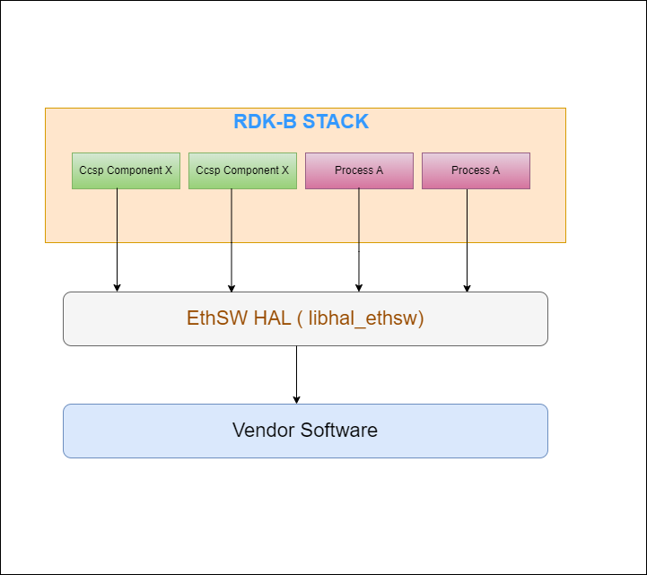
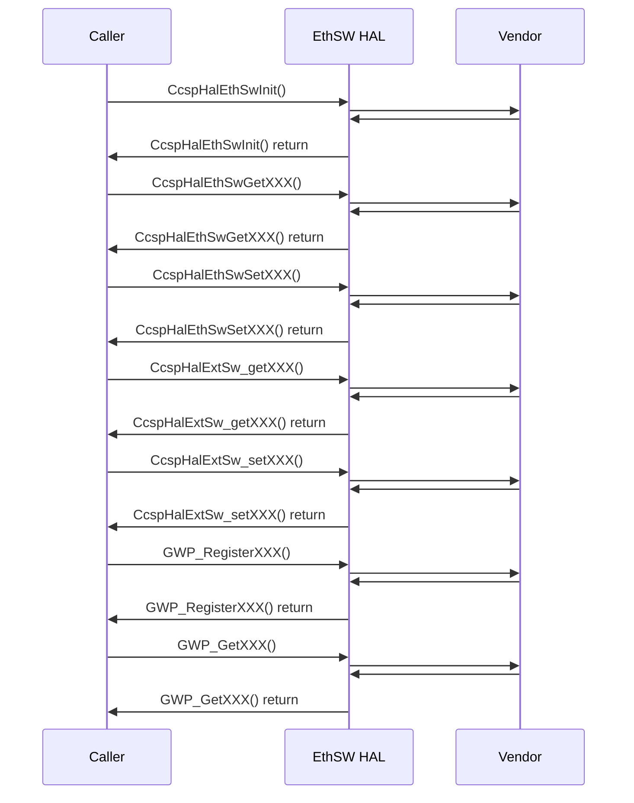

# ETHSW HAL Documentation

## Acronyms

- `HAL` \- Hardware Abstraction Layer
- `RDK-B` \- Reference Design Kit for Broadband Devices
- `OEM` \- Original Equipment Manufacture
- `EthSW` \- Ethernet Switch

## Description

The diagram below describes a high-level software architecture of the EthSW HAL module stack. 



EthSW HAL is an abstraction layer, implemented to interact with vendor software's for getting the hardware specific details such as ethernet swtich port , data link rate , link mode and link status .
This HAL layer is intended to be a common HAL,should be usable by any Ccspcomponents or Processes.

## Component Runtime Execution Requirements

### Initialization and Startup

Below Initialization API's provide opportunity for the HAL code to initialize the appropriate DB's,start threads etc. 

EthSW HAL client module is expected to call the corresponding API Once during bootup before invoking Dependent API's.

- `CcspHalEthSwInit()`

3rd party vendors will implement appropriately to meet operational requirements. This interface is expected to block if the hardware is not ready.

## Threading Model

EthSW HAL is not thread safe, any module which is invoking the EthSW HAL api should ensure calls are made in a thread safe manner.

Vendors can create internal threads/events to meet their operation requirements. These should be responsible to synchronize between the calls, events and cleaned up on closure.

## Process Model

All API's are expected to be called from multiple process.

## Memory Model

EthSW HAL client module is responsible to allocate and deallocate memory for necessary API's as specified in API Documentation.
Different 3rd party vendors allowed to allocate memory for internal operational requirements. In this case 3rd party implementations should be responsible to deallocate internally.

TODO:
State a footprint requirement. Example: This should not exceed XXXX KB.

## Power Management Requirements

The EthSW HAL is not involved in any of the power management operation.
Any power management state transitions MUST not affect the operation of the EthSW HAL. 

## Asynchronous Notification Model

There are no asynchronous notifications.

## Blocking calls

EthSW HAL API's are expected to work synchronously and should complete within a time period commensurate with the complexity of the operation and in accordance with any relevant specification. 
Any calls that can fail due to the lack of a response should have a timeout period in accordance with any relevant documentation.
The upper layers will call this API from a single thread context, this API should not suspend.

TODO:
As we state that they should complete within a time period, we need to state what that time target is, and pull it from the spec if required. Define the timeout requirement.

## Internal Error Handling

All the EthSW HAL API's should return error synchronously as a return argument. HAL is responsible to handle system errors(e.g. out of memory) internally.

## Persistence Model

There is no requirement for HAL to persist any setting information. Application/Client is responsible to persist any settings related to their implementation.

# Nonfunctional requirements

Following non functional requirement should be supported by the EthSW HAL component.

## Logging and debugging requirements

EthSW HAL component should log all the error and critical informative messages, preferably using syslog, printf which helps to debug/triage the issues and understand the functional flow of the system.

The logging should be consistent across all HAL components.

If the vendor is going to log then it has to be logged in `xxx_vendor_hal.log` file name which can be placed in `/rdklogs/logs/` or `/var/tmp/` directory.

Logging should be defined with log levels as per Linux standard logging.

## Memory and performance requirements

Make sure EthSW HAL is not contributing more to memory and CPU utilization while performing normal operations and Commensurate with the operation required.


## Quality Control

EthSW HAL implementation should pass checks using any third party tools like `Coverity`, `Black duck`, `Valgrind` etc. without any issue to ensure quality.

There should not be any memory leaks/corruption introduced by HAL and underneath 3rd party software implementation.


## Licensing

EthSW HAL implementation is expected to released under the Apache License 2.0. 

## Build Requirements

EthSW HAL source code should be able to be built under Linux Yocto environment and should be delivered as a shared library `libhal_ethsw.la`
  
## Variability Management

Changes to the interface will be controlled by versioning, vendors will be expected to implement to a fixed version of the interface, and based on SLA agreements move to later versions as demand requires.

Each API interface will be versioned using [Semantic Versioning 2.0.0](https://semver.org/), the vendor code will comply with a specific version of the interface.

## Platform or Product Customization

The product can be configured via the following compile time defines:

```c
FEATURE_RDKB_WAN_MANAGER        # Enable the WAN Manager
FEATURE_RDKB_AUTO_PORT_SWITCH    # Enable the RDKB Auto Port Switch
```

## Interface API Documentation

All HAL function prototypes and datatype definitions are available in `ccsp_hal_ethsw.h` file.
    
1.   Components/Process must include `ccsp_hal_ethsw.h` to make use of ethsw hal capabilities.
2.   Components/Process should add linker dependency for `libhal_ethsw`.

## Theory of operation and key concepts

Covered as per "Description" sections in the API documentation.

## Sequence Diagram


