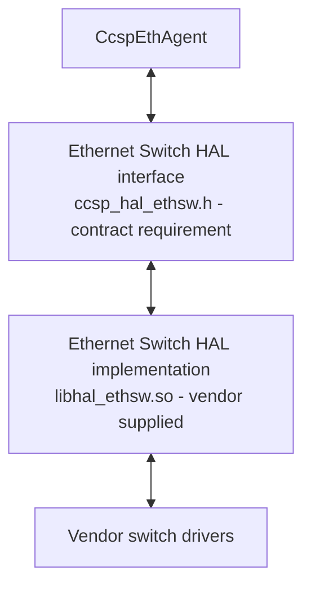
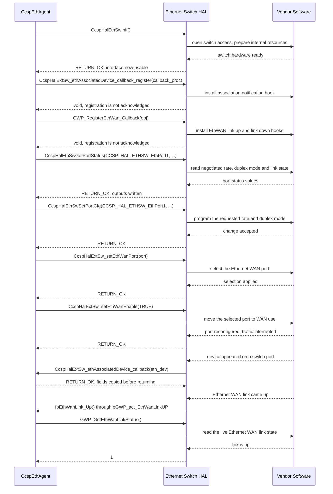

# Ethernet Switch HAL Documentation

## Version History

| Date | Comment | Version |
| --- | --- | --- |
| 2024-08-13 | Initial release. Ethernet Switch HAL header migrated to GitHub. | 1.0.0 |
| 2024-09-16 | Header corrections: a stray comment terminator removed, and `CcspHalExtSw_getCurrentWanHWConf()` placed behind `FEATURE_RDKB_AUTO_PORT_SWITCH`. | 1.0.1 |
| 2024-09-25 | `ETH_5_PORTS` added to the `ETHWAN_DEF_INTF_NUM` ladder (`pri#7`, `RDKCOM-5064`). | 1.1.0 |
| 2026-08-24 | Specification rewritten to the canonical RDK-B HAL topic set: every declared function named in `API Surface`, the asynchronous notification path corrected, and the unresolved footprint and timeout requirements replaced with explicit statements. Describes the interface at tag `1.1.0`. | 1.1.0 |

## Acronyms

- `ACL` \- Access Control List
- `API` \- Application Programming Interface
- `DSCP` \- Differentiated Services Code Point
- `ETHSW` \- Ethernet Switch
- `HAL` \- Hardware Abstraction Layer
- `IGMP` \- Internet Group Management Protocol
- `LAN` \- Local Area Network
- `MAC` \- Media Access Control
- `MLD` \- Multicast Listener Discovery
- `MoCA` \- Multimedia over Coax Alliance
- `QoS` \- Quality of Service
- `RDK-B` \- Reference Design Kit for Broadband
- `SLA` \- Service Level Agreement
- `SoC` \- System on Chip
- `VLAN` \- Virtual Local Area Network
- `WAN` \- Wide Area Network
- `WLAN` \- Wireless Local Area Network

## Description

The diagram below describes a high-level software architecture of the Ethernet Switch HAL module stack.


```mermaid
flowchart TD
    Owner["CcspEthAgent"] <--> Contract["Ethernet Switch HAL interface<br/>ccsp_hal_ethsw.h - contract requirement"]
    Contract <--> Impl["Ethernet Switch HAL implementation<br/>libhal_ethsw.so - vendor supplied"]
    Impl <--> Drivers[Vendor switch drivers]
```

The Ethernet Switch Hardware Abstraction Layer, `ccsp_hal_ethsw`, is the interface through
which the RDK-B stack reads and controls the Ethernet switch of a broadband gateway. It is the
boundary between RDK-B middleware and a vendor's switch software: the header declares the
contract, and a vendor supplies the implementation behind it. In an RDK-B deployment the
service that owns this interface is `CcspEthAgent`.

The interface exists so that a caller can operate a switch without knowing which switch it is.
A caller works in terms of port identifiers, link rates, duplex modes, administrative states
and counters, and the same call sequence produces the same result on any product whose vendor
implements the contract. That gives RDK-B four properties a caller can rely on: one calling
convention across products, an implementation that can be replaced without changing a caller,
a stable set of identifiers and return values, and behaviour that is specified rather than
inferred from a particular switch.

**Scope of this interface.** The contract is the functions listed under `API Surface`, which cover
initialisation, port status and configuration, forwarding-table maintenance, connected-device
enumeration with its notification callback, Ethernet WAN selection, provisioning and link events,
and per-port statistics.

## Component Runtime Execution Requirements

### Initialization and Startup

The Ethernet Switch HAL client module calls the following initialization API **once** during bootup,
before invoking any other API of this interface.

- `CcspHalEthSwInit()`

Three properties of that call bind a caller:

- **Mandatory initialization**: every other function of this interface is defined only after
  `CcspHalEthSwInit()` has returned `RETURN_OK`. On `RETURN_ERR` a caller must not proceed to
  any other function; the return value does not identify which resource failed, so recovery is
  limited to retrying and reporting.
- **Blocking behaviour**: this is the one function of this interface documented as able to
  block, and it may do so while the Ethernet switch hardware is not yet ready. A caller must
  not invoke it from a context that cannot tolerate a delay.
- **No teardown counterpart**: this interface declares no de-initialization, close, cleanup or
  termination function, so there is nothing for a caller to call at shutdown. It likewise does
  not define the effect of calling `CcspHalEthSwInit()` a second time, so a caller must not use
  a repeat call as a way to reset the HAL.

Third party vendors will implement appropriately to meet operational requirements, taking the
documented blocking behaviour into account.

### Threading Model

Ethernet Switch HAL is not thread-safe, any module which is invoking the Ethernet Switch HAL API should ensure
calls are made in a thread-safe manner. This applies to every function in `API Surface`,
including the two registration functions: a caller must not register a callback on one thread
while another thread is calling this interface.

Vendors may implement internal threading and event mechanisms to meet their operational
requirements. These mechanisms must be designed to ensure thread-safety when interacting with
HAL interface. Proper cleanup of allocated resources (e.g., memory, file handles, threads) is
mandatory when the vendor software terminates or closes its connection to the HAL.

The thread on which a callback is delivered is a separate question, and this interface does not
answer it. See `Asynchronous Notification Model`.

### Process Model

All APIs are expected to be called from multiple processes. Due to this concurrent access,
vendors must implement protection mechanisms within their API implementations to handle
multiple processes calling the same API simultaneously. This is crucial to ensure data
integrity, prevent race conditions, and maintain the overall stability and reliability of the
system.

### Memory Model

Storage exchanged across this interface is allocated and released by the caller, with one
declared exception recorded under `Module Responsibilities`.

No memory footprint limit is specified for this interface. Neither the header nor this
specification states a maximum resident size, a maximum allocation, or a bound on the size of
the device array `CcspHalExtSw_getAssociatedDevice()` returns, so a caller must not size its
own budget from this contract and an implementer is not held to a figure by it.

#### Caller Responsibilities

- Allocate every `[out]` structure and buffer before the call, and release it afterwards. This
  covers `CCSP_HAL_ETH_STATS` for `CcspHalEthSwGetEthPortStats()`, the enumerated `[out]`
  parameters of the port getters, and the interface-name buffer for
  `GWP_GetEthWanInterfaceName()`.
- Keep every `[in]` buffer valid for the duration of the call. This interface does not state
  whether a callee retains a pointer it was given, so a caller must not pass storage it is
  about to release, and must keep an `appCallBack` object alive for as long as notifications
  are wanted.
- Pass no NULL pointer where a parameter is documented as required.
- Treat every output as unset when a call returns `RETURN_ERR`. This interface does not define
  whether an output was partially written on failure, so a caller discards it rather than
  reading part of it.
- Zero-fill the `GWP_GetEthWanInterfaceName()` buffer before the call, because this interface
  does not state that the name it writes is NUL-terminated.

#### Module Responsibilities

- Handle and deallocate memory used for internal operations, and release all internally
  allocated memory when the connection to the caller ends, so that nothing leaks.
- Write only within the bounds a caller supplied, honouring the `maxSize` argument of
  `GWP_GetEthWanInterfaceName()`.
- One function inverts the ownership convention, and a caller cannot get it right by following
  the general rule. `CcspHalExtSw_getAssociatedDevice()` allocates the `eth_device_t` array
  itself and stores its address in the caller's `output_struct` pointer, with the element count
  in `output_array_size`; the caller owns that array afterwards and must release it, otherwise
  every call leaks. This interface does not state which allocator produced the array and
  declares no release function of its own, so the matching deallocator is not established by
  this contract and must be confirmed with the vendor implementation. On `RETURN_ERR` no array
  was handed over and a caller must not attempt to release one.

### Power Management Requirements

The Ethernet Switch HAL is not involved in any of the power management operation.

### Asynchronous Notification Model

This interface has two asynchronous notification paths. Both are installed by a registration
function that the header marks with the generator's `execution` alias, value `callback`, and both
deliver events that a caller would otherwise have to discover by polling.

- `CcspHalExtSw_ethAssociatedDevice_callback_register()` installs a
  `CcspHalExtSw_ethAssociatedDevice_callback`, which the implementation invokes each time a
  device associates with or disassociates from a switch port. The event carries an
  `eth_device_t` describing the device, and `eth_Active` distinguishes an arrival from a
  departure. This replaces polling `CcspHalExtSw_getAssociatedDevice()`.
- `GWP_RegisterEthWan_Callback()` installs the pair of Ethernet WAN link callbacks a caller
  supplies in an `appCallBack`: `fpEthWanLink_Up` in `pGWP_act_EthWanLinkUP` and
  `fpEthWanLink_Down` in `pGWP_act_EthWanLinkDown`. This replaces polling
  `GWP_GetEthWanLinkStatus()`.

Four constraints apply to both paths, and each of them is a limit of the contract rather than a
recommendation:

- **The execution context is not specified.** This interface does not state the thread or
  process a callback runs on, whether deliveries are serialised, or whether calling back into
  this HAL from inside a callback is permitted. A caller must therefore protect its own state,
  must not assume the callback runs on the registering thread, and should return promptly and
  defer real work rather than block the implementation.
- **The lifetime of the data passed to a callback is not specified.** This interface states
  neither who owns the `eth_device_t` a `CcspHalExtSw_ethAssociatedDevice_callback` receives nor
  how long the pointer stays valid, so a callback must treat both as unknown: copy any field it
  needs to keep rather than storing the pointer, release nothing, and not rely on the structure
  remaining readable after the callback returns.
- **Registration reports nothing.** Both registration functions return `void`, so a caller
  cannot tell from the call whether registration succeeded; confirmation is available only
  indirectly, by observing that notifications arrive.
- **Registration is not reversible and not repeatable.** This interface defines no way to
  remove a registration and does not state whether a second call replaces the first or adds to
  it, so a caller registers once. It also does not state whether a NULL callback or a partially
  populated `appCallBack` is a valid way to decline an event, so a caller supplies every
  function it registers.

The Ethernet WAN link callbacks take no argument and return nothing, so the notification
carries no detail beyond the fact of the event. A caller that needs the port, the interface
name or the current link state queries `CcspHalExtSw_getEthWanPort()`,
`GWP_GetEthWanInterfaceName()` or `GWP_GetEthWanLinkStatus()` from inside or after the
callback.

### Blocking calls

**Synchronous and Responsive**: All APIs within this module should operate synchronously and
complete within a reasonable timeframe based on the complexity of the operation.

**Timeout Handling**: This interface specifies no timeout value for any of its functions,
neither a default nor a maximum, and defines no error that distinguishes a timeout from any
other failure. A caller that needs a bound on how long a call may take must impose and enforce
that bound itself, and must not expect the implementation to return control at a particular
deadline.

**Non-Blocking Requirement**: Given the single-threaded environment in which these APIs will be
called, it is imperative that they do not block or suspend execution of the main thread.
Implementations must avoid long-running operations or utilize asynchronous mechanisms where
necessary to maintain responsiveness. `CcspHalEthSwInit()` is the one documented exception, as
recorded under `Initialization and Startup`.

### Internal Error Handling

**Synchronous Error Handling**: All APIs must return errors synchronously as a return value.
This ensures immediate notification of errors to the caller.

**Internal Error Reporting**: The HAL is responsible for reporting any internal system errors
(e.g., out-of-memory conditions) through the return value.

**Focus on Logging for Errors**: For system errors, the HAL should prioritize logging the error
details for further investigation and resolution.

**One error value, and no discrimination between causes**: a status-returning function of this
interface reports success as `RETURN_OK` (0) and every failure as `RETURN_ERR` (-1). The
interface defines no error-code enumeration, so the return value identifies that a call failed
but never why: an invalid argument, an unimplemented port, and a hardware or communication
fault are indistinguishable from it. A caller that needs to tell those cases apart validates
its own arguments before the call and consults the vendor log described under
`Logging and debugging requirements`. Three cases sit outside that convention and a caller must
handle each on its own terms:

- `GWP_GetEthWanLinkStatus()` returns `1` for a link that is up, `0` for a link that is down,
  and a negative value when the state could not be determined. A caller tests for a negative
  value first and must not treat it as "down", because a failed query and a down link are
  different facts. On error the header states that `errno` should be checked for details; the
  specific negative value is not defined by this interface.
- `CcspHalExtSw_getCurrentWanHWConf()` returns `BOOLEAN`, `TRUE` when a hardware WAN
  configuration is enabled and `FALSE` when a LAN configuration is enabled. The interface does not provide an error reporting channel.  Consequently, a query failure cannot be distinguished from a successful query returning FALSE, and no alternative mechanism is provided to determine whether the operation completed successfully.
- `CcspHalExtSw_ethAssociatedDevice_callback_register()` and `GWP_RegisterEthWan_Callback()`
  return `void`, so a failed registration is not reported either. See
  `Asynchronous Notification Model`.

### Persistence Model

There is no requirement for HAL to persist any setting information. A caller must therefore
re-apply configuration after re-initialisation rather than assume that a port configuration, an
administrative state, an aging speed or an Ethernet WAN selection survived a restart, because
this interface does not state that any of them does.

## Non functional requirements

Following non functional requirement should be supported by the Ethernet Switch HAL component.

### Logging and debugging requirements

The component is required to record all errors and critical informative messages to aid in
identifying, debugging, and understanding the functional flow of the system. Logging should be
implemented using the syslog method, as it provides robust logging capabilities suited for
system-level software. The use of `printf` is discouraged unless `syslog` is not available.

All HAL components must adhere to a consistent logging process. When logging is necessary, it
should be performed into the `ethsw_vendor_hal.log` file, which is located in either the
`/var/tmp/` or `/rdklogs/logs/` directories.

Logs must be categorized according to the following log levels, as defined by the Linux
standard logging system, listed here in descending order of severity:

- **FATAL**: Critical conditions, typically indicating system crashes or severe failures that
  require immediate attention.
- **ERROR**: Non-fatal error conditions that nonetheless significantly impede normal operation.
- **WARNING**: Potentially harmful situations that do not yet represent errors.
- **NOTICE**: Important but not error-level events.
- **INFO**: General informational messages that highlight system operations.
- **DEBUG**: Detailed information typically useful only when diagnosing problems.
- **TRACE**: Very fine-grained logging to trace the internal flow of the system.

Each log entry should include a timestamp, the log level, and a message describing the event or
condition. This standard format will facilitate easier parsing and analysis of log files across
different vendors and components.

This log is the only diagnostic channel the contract provides for a failure the return value
cannot describe. Because every failure of a status-returning function arrives as the single
value `RETURN_ERR`, an implementation is expected to record what actually failed here, and a
caller investigating a failure reads this file rather than inferring a cause from the return
value.


### Memory and performance requirements

The component should be designed for efficiency, minimizing its impact on system resources
during normal operation. Resource utilization (e.g., CPU, memory) should be proportional to the
specific task being performed and align with any performance expectations documented in the API
specifications.

### Quality Control

To ensure the highest quality and reliability, it is strongly recommended that third-party
quality assurance tools like `Coverity`, `Black Duck`, and `Valgrind` be employed to thoroughly
analyze the implementation. The goal is to detect and resolve potential issues such as memory
leaks, memory corruption, or other defects before deployment.

Furthermore, both the HAL wrapper and any third-party software interacting with it must
prioritize robust memory management practices. This includes meticulous allocation,
deallocation, and error handling to guarantee a stable and leak-free operation.


### Licensing

The implementation is expected to be released under the Apache License 2.0.

### Build Requirements

The source code should be capable of, but not be limited to, building under the Yocto
distribution environment. The recipe should deliver a shared library named as
`libhal_ethsw.so`.

To use this interface:

1. Components/Process must include `ccsp_hal_ethsw.h` to make use of Ethernet Switch HAL capabilities.
2. Components/Process should add linker dependency for `libhal_ethsw.so`.

The Yocto distribution environment and `libhal_ethsw.so` are the only toolchain and build
artefact this repository declares. It declares no compiler version, no minimum language
standard, no dependency on another library, and no build system of its own: this repository
carries the interface header and its documentation, not an implementation. A caller therefore
takes those constraints from the product's own build configuration rather than from this
contract.

### Variability Management

The role of adjusting the interface, guided by versioning, rests solely within architecture
requirements. Thereafter, vendors are obliged to align their implementation with a designated
version of the interface. As per Service Level Agreement (SLA) terms, they may transition to
newer versions based on demand needs.

Each API interface will be versioned using [Semantic Versioning 2.0.0](https://semver.org/spec/v2.0.0.html),
the vendor code will comply with a specific version of the interface.

### Platform or Product Customization

The product can be configured via the following compile time defines:

```c
FEATURE_RDKB_WAN_MANAGER        # Enable the WAN Manager
FEATURE_RDKB_AUTO_PORT_SWITCH   # Enable the RDKB Auto Port Switch
```
It's important to note that `CcspHalExtSw_ethPortConfigure()` is declared only when both
`FEATURE_RDKB_WAN_MANAGER` and `FEATURE_RDKB_AUTO_PORT_SWITCH` are defined.
`CcspHalExtSw_getCurrentWanHWConf()` is declared only when
`FEATURE_RDKB_AUTO_PORT_SWITCH` is defined.

A second compile-time customization selects the default Ethernet WAN interface index. The
header sets `ETHWAN_DEF_INTF_NUM` from the first matching hardware-configuration macro:

| Compile-time macros defined | `ETHWAN_DEF_INTF_NUM` |
| --- | --- |
| `ETH_6_PORTS` | 5 |
| `ETH_5_PORTS` | 4 |
| `ETH_4_PORTS` | 3 |
| `ETH_2_PORTS` and `MODEM_ONLY_SUPPORT` | 0 |
| none of the above | 0 |

Two properties of that index bind a caller. It is **0-based**, so the first physical port is 0,
which is a different numbering from the 1-based `CCSP_HAL_ETHSW_PORT` enumeration and is not
interchangeable with it. And the value is fixed when the header is compiled: this interface
provides no runtime override of the default, so a caller that needs a different Ethernet WAN
port calls `CcspHalExtSw_setEthWanPort()`, which changes the selected port and leaves the
compile-time default unchanged.

## Interface API Documentation

### Theory of operation and key concepts

This document and the `ccsp_hal_ethsw.h` header file define
the interface and functionality of the Ethernet Switch Hardware Abstraction Layer (HAL) within
the RDK-B framework. The header is the authority on what the interface is: it carries the
declarations, the types a caller constructs or interprets, and a per-function contract stating
argument ranges, pre-conditions, post-conditions, return values and the caller's recovery
action. This document states the properties that hold across the whole interface, and
`API Surface` maps every declared function to its declaration.

Two concepts run through the whole interface and are easy to get wrong.

**A port is identified in one of two unrelated numbering schemes.** The switch ports that
`CcspHalEthSwGetPortStatus()`, `CcspHalEthSwGetPortCfg()`, `CcspHalEthSwSetPortCfg()`,
`CcspHalEthSwGetPortAdminStatus()`, `CcspHalEthSwSetPortAdminStatus()`,
`CcspHalEthSwSetAgingSpeed()` and `CcspHalEthSwGetEthPortStats()` act on are named by the
1-based `CCSP_HAL_ETHSW_PORT` enumeration, whose first value `CCSP_HAL_ETHSW_EthPort1` is 1.
The Ethernet WAN port that `CcspHalExtSw_getEthWanPort()` and `CcspHalExtSw_setEthWanPort()`
carry, and the value in `ETHWAN_DEF_INTF_NUM`, are a 0-based index instead, and this interface
does not define that index's upper bound: no symbol here states how many external Ethernet
ports a product has, so a caller must obtain the port count from the platform rather than
derive one from `CCSP_HAL_ETHSW_PORT`. Two further port values belong to neither scheme. The
`eth_port` member of `eth_device_t` is a 0-based external Ethernet port index (0 to MaxEthPort-1)
and is not a `CCSP_HAL_ETHSW_PORT` enumerator. The port number
`CcspHalEthSwLocatePortByMacAddress()` writes is header-defined: `0` denotes the MoCA port and
`1-4` denote Ethernet ports.
This interface defines no conversion between any of these schemes, so a caller must not pass an
index from one to a function that expects another, and must establish the meaning of a located
port number or a reported `eth_port` with the vendor implementation before acting on it.

**An administrative state and a link state are independent facts.** The administrative state is
what an operator requested, read with `CcspHalEthSwGetPortAdminStatus()` and set with
`CcspHalEthSwSetPortAdminStatus()`. The link state is what the hardware currently has, read
with `CcspHalEthSwGetPortStatus()`. A port can be administratively up while its link is down,
so a caller must read the state it actually needs rather than deducing one from the other. The
same distinction separates the three Ethernet WAN views: `CcspHalExtSw_getEthWanEnable()`
reports the feature setting, `GWP_GetEthWanLinkStatus()` reports the live link, and
`CcspHalExtSw_getCurrentWanHWConf()` reports which hardware configuration the product is in.

#### Object Lifecycles

- **Creation and destruction**: the HAL does not create or destroy objects. It manipulates the
  state and configuration of Ethernet switch hardware that already exists, and it identifies
  what to act on by parameter: a `CCSP_HAL_ETHSW_PORT` enumerator, an Ethernet WAN port index,
  or a MAC address. Those identifiers are properties of the hardware, not handles this
  interface issues.
- **Caller-owned storage**: a caller allocates the structures that receive information -
  `CCSP_HAL_ETH_STATS` for `CcspHalEthSwGetEthPortStats()`, an `appCallBack` for
  `GWP_RegisterEthWan_Callback()`, the interface-name buffer for
  `GWP_GetEthWanInterfaceName()`, and the enumerated outputs of the port getters - and releases
  them when it has finished. The HAL writes into them; this interface does not state whether it
  retains any of those pointers, so a caller keeps the storage valid rather than assuming a
  pointer was discarded when the call returned. See `Memory Model`.
- **The one HAL-owned allocation**: `CcspHalExtSw_getAssociatedDevice()` allocates the
  `eth_device_t` array it returns and transfers it to the caller, which must release it. The
  matching deallocator is not established by this contract. See `Memory Model`.
- **Storage delivered to a callback**: this interface states neither the owner nor the valid
  lifetime of the `eth_device_t` delivered to a
  `CcspHalExtSw_ethAssociatedDevice_callback`, so a callback copies what it needs, releases
  nothing, and does not rely on the structure outliving the call.
- **Interface lifetime**: `CcspHalEthSwInit()` opens the interface for use and there is no
  counterpart that closes it. A registration made with
  `CcspHalExtSw_ethAssociatedDevice_callback_register()` or `GWP_RegisterEthWan_Callback()`
  cannot be withdrawn through this interface either, so the functions a caller registers must
  remain callable for as long as the process runs.

#### Method Sequencing

- **Initialization first**: `CcspHalEthSwInit()` must return `RETURN_OK` before any other
  function of this interface is called. Every declaration in the header states that
  pre-condition individually.
- **Registration before the events matter**: install the association callback and the Ethernet
  WAN link callbacks after initialization and before the caller depends on being notified,
  because events that occur before registration are not replayed by this interface.
- **Select, then enable, for Ethernet WAN**: `CcspHalExtSw_setEthWanEnable()` acts on the port
  that `CcspHalExtSw_getEthWanPort()` reports, so a caller that wants a specific port calls
  `CcspHalExtSw_setEthWanPort()` first. Where the automatic port-switch feature is built,
  `CcspHalExtSw_ethPortConfigure()` performs the equivalent change by interface name instead of
  by index.
- **Read back rather than assume**: after a failed `CcspHalExtSw_setEthWanEnable()` or
  `CcspHalExtSw_ethPortConfigure()` the return value does not say whether the change was
  partially applied, so a caller re-reads the state with `CcspHalExtSw_getEthWanEnable()` and
  `CcspHalExtSw_getEthWanPort()`. `CcspHalEthSwSetAgingSpeed()` is the exception that cannot be
  checked: this interface provides no way to read an aging speed back.
- **Otherwise unordered**: the remaining getters and setters may be called in any order after
  initialization, subject to the serialization `Threading Model` requires.

#### State-Dependent Behavior

- **Port existence**: a port-scoped call is meaningful only for a port the product implements.
  Which enumerators of `CCSP_HAL_ETHSW_PORT` are implemented is a property of the product, so a
  caller must handle `RETURN_ERR` for a valid enumerator on hardware that has no such port.
  `CCSP_HAL_ETHSW_PortMax` is a count and sentinel rather than a port, and passing it is an
  invalid argument.
- **Link state**: `CcspHalEthSwGetPortStatus()` reports what a port has negotiated, which is
  not necessarily what it was configured for. `CcspHalEthSwGetPortCfg()` reports the
  configuration. With `CCSP_HAL_ETHSW_LINK_Auto` or `CCSP_HAL_ETHSW_DUPLEX_Auto` configured, a
  read returns the negotiated rate or mode once a link is up rather than the `Auto` value.
- **Administrative state**: a port in `CCSP_HAL_ETHSW_AdminDown` will not establish a link.
  `CCSP_HAL_ETHSW_AdminTest` is a vendor-defined test mode whose behaviour this interface does
  not specify, so a caller must not assume a port in that state forwards traffic.
- **Learned addresses**: `CcspHalEthSwLocatePortByMacAddress()` can only find an address the
  switch has already learned, so an idle or newly attached device may be absent, and
  `RETURN_ERR` does not distinguish "not present" from a failure to read the tables. The
  lifetime of a learned address is what `CcspHalEthSwSetAgingSpeed()` governs.
- **Counters**: the values in `CCSP_HAL_ETH_STATS` depend on the traffic the port has carried.
  This interface specifies no unit beyond the byte-or-packet distinction in the member names,
  does not say whether a counter covers the life of the port or a shorter window, does not
  define how it wraps, and provides no way to reset one. A caller computing a rate differences
  two samples over its own elapsed time and tolerates a counter that wraps or restarts.
- **Build-dependent presence**: `CcspHalExtSw_ethPortConfigure()` and
  `CcspHalExtSw_getCurrentWanHWConf()` do not exist in a build that does not define their
  feature macros, which is a compile-time condition rather than a runtime state. See
  `Platform or Product Customization`.

### Data Structures and Defines

All type and macro definitions are declared in
`ccsp_hal_ethsw.h`, which documents each member. The tables
below list what a caller must construct or interpret, with the line in that header on which each
name is defined.

**Enumerations:**

| Type | What it represents |
| --- | --- |
| `CCSP_HAL_ETHSW_PORT` | The port a port-scoped call acts on. 1-based: `CCSP_HAL_ETHSW_EthPort1` is 1 and the external ports run to `CCSP_HAL_ETHSW_EthPort8`, followed in declaration order by `CCSP_HAL_ETHSW_Moca1` and `CCSP_HAL_ETHSW_Moca2`, `CCSP_HAL_ETHSW_Wlan1` through `CCSP_HAL_ETHSW_Wlan4`, `CCSP_HAL_ETHSW_Processor1` and `CCSP_HAL_ETHSW_Processor2`, `CCSP_HAL_ETHSW_InterconnectPort1` and `CCSP_HAL_ETHSW_InterconnectPort2` for links to another switch or SoC block, `CCSP_HAL_ETHSW_MgmtPort`, and `CCSP_HAL_ETHSW_PortMax` as the count and exclusive upper bound. |
| `CCSP_HAL_ETHSW_LINK_RATE` | A port's link speed: `CCSP_HAL_ETHSW_LINK_NULL` (0, no link established, not a rate to configure), then `CCSP_HAL_ETHSW_LINK_10Mbps`, `CCSP_HAL_ETHSW_LINK_100Mbps`, `CCSP_HAL_ETHSW_LINK_1Gbps`, `CCSP_HAL_ETHSW_LINK_2_5Gbps`, `CCSP_HAL_ETHSW_LINK_5Gbps`, `CCSP_HAL_ETHSW_LINK_10Gbps` and `CCSP_HAL_ETHSW_LINK_Auto`. |
| `CCSP_HAL_ETHSW_DUPLEX_MODE` | A port's duplex mode: `CCSP_HAL_ETHSW_DUPLEX_Auto` (0), `CCSP_HAL_ETHSW_DUPLEX_Half`, `CCSP_HAL_ETHSW_DUPLEX_Full`. |
| `CCSP_HAL_ETHSW_LINK_STATUS` | A port's operational link state: `CCSP_HAL_ETHSW_LINK_Up` (0), `CCSP_HAL_ETHSW_LINK_Down` (no link although a peer may be attached), `CCSP_HAL_ETHSW_LINK_Disconnected` (nothing attached). |
| `CCSP_HAL_ETHSW_ADMIN_STATUS` | A port's requested administrative state: `CCSP_HAL_ETHSW_AdminUp` (0), `CCSP_HAL_ETHSW_AdminDown`, `CCSP_HAL_ETHSW_AdminTest`. |

**Structures:**

| Type | What it represents |
| --- | --- |
| `CCSP_HAL_ETH_STATS` | Fifteen traffic and error counters for one port, filled in by `CcspHalEthSwGetEthPortStats()` into caller-owned storage: `BytesSent` and `BytesReceived`, `PacketsSent` and `PacketsReceived`, `ErrorsSent` and `ErrorsReceived`, `UnicastPacketsSent` and `UnicastPacketsReceived`, `DiscardPacketsSent` and `DiscardPacketsReceived`, `MulticastPacketsSent` and `MulticastPacketsReceived`, `BroadcastPacketsSent` and `BroadcastPacketsReceived`, and `UnknownProtoPacketsReceived`. |
| `eth_device_t` | One device observed on a switch port, as reported by `CcspHalExtSw_getAssociatedDevice()` and by the association callback: `eth_devMacAddress` (6 binary octets, octet order unspecified), `eth_port` (0-based external Ethernet port index, 0 to MaxEthPort-1; not a `CCSP_HAL_ETHSW_PORT` enumerator), `eth_vlanid` (1 to 4094, reported for information only), `eth_devTxRate` and `eth_devRxRate` (unit vendor-defined, not comparable across implementations), and `eth_Active` (`TRUE` while present, and the member that distinguishes an association from a disassociation). Writing to a received structure changes nothing in the switch. |
| `appCallBack` | The pair of Ethernet WAN link callbacks a caller fills in and passes to `GWP_RegisterEthWan_Callback()`: `pGWP_act_EthWanLinkUP` and `pGWP_act_EthWanLinkDown`. |

**Pointer typedefs**, each declared with its base type and used as the `[out]` parameter form:
`PCCSP_HAL_ETHSW_PORT`, `PCCSP_HAL_ETHSW_LINK_RATE`,
`PCCSP_HAL_ETHSW_DUPLEX_MODE`, `PCCSP_HAL_ETHSW_LINK_STATUS`,
`PCCSP_HAL_ETHSW_ADMIN_STATUS` and `PCCSP_HAL_ETH_STATS`.

**Callback typedefs**, each with the function that installs it:

| Callback typedef | Installed by |
| --- | --- |
| `CcspHalExtSw_ethAssociatedDevice_callback` | `CcspHalExtSw_ethAssociatedDevice_callback_register()` |
| `fpEthWanLink_Up` | `GWP_RegisterEthWan_Callback()`, in `appCallBack.pGWP_act_EthWanLinkUP` |
| `fpEthWanLink_Down` | `GWP_RegisterEthWan_Callback()`, in `appCallBack.pGWP_act_EthWanLinkDown` |

**Macro constants:**

| Macro | Value and meaning |
| --- | --- |
| `RETURN_OK` | 0. Success, and the only value indicating that a status-returning function honoured its post-conditions. |
| `RETURN_ERR` | -1. Failure, and the interface's only error value. See `Internal Error Handling`. |
| `TRUE` | 1. The true value to use for a `BOOLEAN` argument or output; no other non-zero value is defined. |
| `FALSE` | 0. The false value to use for a `BOOLEAN` argument or output. |
| `UP` / `DOWN` | The strings `"up"` and `"down"` an implementation reports for an interface state; compare against these rather than against a locally spelled literal. |
| `ETHWAN_DEF_INTF_NUM` | The compile-time default Ethernet WAN interface index, 0-based, selected by the ladder in `Platform or Product Customization`. |
| `ETHWAN_INTERFACE_NAME_MAX_LENGTH` | 32. Header macro for interface-name length; note that `GWP_GetEthWanInterfaceName()` currently documents a minimum 64-byte buffer, so size buffers to the stricter requirement. |

The header also defines the guarded type aliases `ULONG`, `ULLONG`, `CHAR`, `UCHAR`, `BOOLEAN`,
`INT` and `UINT` so that it can be included where no RDK-B platform type header is available.
Each is used only when the including translation unit has not already provided that name, so a
caller treats them as spellings of the underlying C types rather than as distinct types.

### API Surface

Eighteen functions are always declared, and up to two additional functions are declared only when their feature macros are enabled (see `Platform or Product Customization`). All declarations live in
[ccsp_hal_ethsw.h](../../include/ccsp_hal_ethsw.h), which carries the full per-function
contract for each: argument ranges, pre-conditions, post-conditions, every return value with
the reason it occurs, and the caller's recovery action. The groups below cover the entire
interface and nothing outside it.

**Lifecycle (1):**

| Function | Purpose |
| --- | --- |
| `CcspHalEthSwInit` | Prepares the switch and the HAL for use. Called once at bootup before every other function of this interface. |

**Port configuration and status (6):**

| Function | Purpose |
| --- | --- |
| `CcspHalEthSwGetPortStatus` | Reads the live link rate, duplex mode and link state a port has negotiated. |
| `CcspHalEthSwGetPortCfg` | Reads the link rate and duplex mode a port is configured for. |
| `CcspHalEthSwSetPortCfg` | Configures a port's link rate and duplex mode. |
| `CcspHalEthSwGetPortAdminStatus` | Reads a port's administrative state. |
| `CcspHalEthSwSetPortAdminStatus` | Sets a port's administrative state, which is how a port is enabled or disabled. |
| `CcspHalEthSwSetAgingSpeed` | Sets how quickly a port ages MAC addresses out of the forwarding table. The unit and range are vendor-defined and the value cannot be read back. |

**MAC-address and associated-device discovery (3):**

| Function | Purpose |
| --- | --- |
| `CcspHalEthSwLocatePortByMacAddress` | Finds which port a learned MAC address is associated with, in a numbering this interface does not define. |
| `CcspHalExtSw_getAssociatedDevice` | Enumerates the devices currently seen on the Ethernet ports as a snapshot. The HAL allocates the array and the caller releases it. |
| `CcspHalExtSw_ethAssociatedDevice_callback_register` | Installs the device association and disassociation callback. Returns `void`. |

**Ethernet WAN selection and provisioning (7):**

| Function | Purpose |
| --- | --- |
| `CcspHalExtSw_ethPortConfigure` | Puts one named Ethernet interface into or out of WAN mode. **Declared only when`FEATURE_RDKB_AUTO_PORT_SWITCH` and FEATURE_RDKB_WAN_MANAGER is defined.** |
| `CcspHalExtSw_getEthWanEnable` | Reads whether the Ethernet WAN feature is enabled. |
| `CcspHalExtSw_setEthWanEnable` | Enables or disables the Ethernet WAN feature on the currently selected port. |
| `CcspHalExtSw_getCurrentWanHWConf` | Reports whether the hardware is wired for WAN or for LAN use. Returns `BOOLEAN` and has no error channel. **Declared only when `FEATURE_RDKB_AUTO_PORT_SWITCH` is defined.** |
| `CcspHalExtSw_getEthWanPort` | Reads which Ethernet port is selected for WAN use, as a 0-based index. |
| `CcspHalExtSw_setEthWanPort` | Sets the Ethernet WAN port index. |
| `GWP_GetEthWanInterfaceName` | Reads the name of the interface currently used for Ethernet WAN into a caller-supplied buffer. |

**Ethernet WAN link events (2):**

| Function | Purpose |
| --- | --- |
| `GWP_RegisterEthWan_Callback` | Installs the Ethernet WAN link up and link down callbacks from a caller-owned `appCallBack`. Returns `void`. |
| `GWP_GetEthWanLinkStatus` | Reports the live Ethernet WAN link state: 1 up, 0 down, negative when it could not be determined. |

**Statistics and diagnostics (1):**

| Function | Purpose |
| --- | --- |
| `CcspHalEthSwGetEthPortStats` | Fills a caller-supplied `CCSP_HAL_ETH_STATS` with one port's counters. |

The three callback typedefs a caller implements rather than calls -
`CcspHalExtSw_ethAssociatedDevice_callback`, `fpEthWanLink_Up` and `fpEthWanLink_Down` - are
listed with their registration functions under `Data Structures and Defines`.

### Sequence Diagram

The exchange below uses only declared identifiers. It shows initialization, both callback
registrations, a port read, a port write, an Ethernet WAN selection and the later delivery of
each notification.


```mermaid
sequenceDiagram
    participant Caller as CcspEthAgent
    participant HAL as Ethernet Switch HAL
    participant Vendor as Vendor Software
    Caller->>HAL: CcspHalEthSwInit()
    HAL->>Vendor: open switch access, prepare internal resources
    Vendor-->>HAL: switch hardware ready
    HAL-->>Caller: RETURN_OK, interface now usable
    Caller->>HAL: CcspHalExtSw_ethAssociatedDevice_callback_register(callback_proc)
    HAL->>Vendor: install association notification hook
    HAL-->>Caller: void, registration is not acknowledged
    Caller->>HAL: GWP_RegisterEthWan_Callback(obj)
    HAL->>Vendor: install EthWAN link up and link down hooks
    HAL-->>Caller: void, registration is not acknowledged
    Caller->>HAL: CcspHalEthSwGetPortStatus(CCSP_HAL_ETHSW_EthPort1, ...)
    HAL->>Vendor: read negotiated rate, duplex mode and link state
    Vendor-->>HAL: port status values
    HAL-->>Caller: RETURN_OK, outputs written
    Caller->>HAL: CcspHalEthSwSetPortCfg(CCSP_HAL_ETHSW_EthPort1, ...)
    HAL->>Vendor: program the requested rate and duplex mode
    Vendor-->>HAL: change accepted
    HAL-->>Caller: RETURN_OK
    Caller->>HAL: CcspHalExtSw_setEthWanPort(port)
    HAL->>Vendor: select the Ethernet WAN port
    Vendor-->>HAL: selection applied
    HAL-->>Caller: RETURN_OK
    Caller->>HAL: CcspHalExtSw_setEthWanEnable(TRUE)
    HAL->>Vendor: move the selected port to WAN use
    Vendor-->>HAL: port reconfigured, traffic interrupted
    HAL-->>Caller: RETURN_OK
    Vendor-->>HAL: device appeared on a switch port
    HAL->>Caller: CcspHalExtSw_ethAssociatedDevice_callback(eth_dev)
    Caller-->>HAL: RETURN_OK, fields copied before returning
    Vendor-->>HAL: Ethernet WAN link came up
    HAL->>Caller: fpEthWanLink_Up() through pGWP_act_EthWanLinkUP
    Caller->>HAL: GWP_GetEthWanLinkStatus()
    HAL->>Vendor: read the live Ethernet WAN link state
    Vendor-->>HAL: link is up
    HAL-->>Caller: 1
```

The two notification arrows into the caller carry no guarantee about which thread they arrive
on, because this interface does not specify one. See `Asynchronous Notification Model`.

### State Diagram

**No state diagram is drawn for this interface, and that is a statement about the contract
rather than an omission.** This interface exposes state as values a caller reads. It does not
define which transitions between those values are legal, in what order they occur, or which
event causes one, so any diagram drawn here would assert edges the interface does not
establish. A caller polls for the state it needs, or registers for the notifications described
under `Asynchronous Notification Model`, rather than relying on a sequence.

The state values a caller can observe are these:

- **Port link state** \- `CCSP_HAL_ETHSW_LINK_STATUS` from `CcspHalEthSwGetPortStatus()`:
  `CCSP_HAL_ETHSW_LINK_Up`, `CCSP_HAL_ETHSW_LINK_Down`, `CCSP_HAL_ETHSW_LINK_Disconnected`.
- **Port administrative state** \- `CCSP_HAL_ETHSW_ADMIN_STATUS` from
  `CcspHalEthSwGetPortAdminStatus()`: `CCSP_HAL_ETHSW_AdminUp`, `CCSP_HAL_ETHSW_AdminDown`,
  `CCSP_HAL_ETHSW_AdminTest`. Set with `CcspHalEthSwSetPortAdminStatus()`. Independent of the
  link state, as recorded under `Theory of operation and key concepts`.
- **Negotiated and configured port settings** \- `CCSP_HAL_ETHSW_LINK_RATE` and
  `CCSP_HAL_ETHSW_DUPLEX_MODE` from `CcspHalEthSwGetPortStatus()` and
  `CcspHalEthSwGetPortCfg()`. `CCSP_HAL_ETHSW_LINK_NULL` reports that no link is established.
- **Ethernet WAN feature setting** \- the `BOOLEAN` from `CcspHalExtSw_getEthWanEnable()`,
  changed by `CcspHalExtSw_setEthWanEnable()`.
- **Ethernet WAN link state** \- the 1, 0 or negative result of `GWP_GetEthWanLinkStatus()`,
  where a negative value means the state could not be determined and must not be read as
  "down".
- **Ethernet WAN hardware configuration** \- the `BOOLEAN` from
  `CcspHalExtSw_getCurrentWanHWConf()` where that function is built, `TRUE` for WAN and `FALSE`
  for LAN.
- **Device presence** \- `eth_Active` in each `eth_device_t` from
  `CcspHalExtSw_getAssociatedDevice()` or from an association callback.

The one ordering constraint this interface does establish is the initialisation pre-condition:
every function above is defined only after `CcspHalEthSwInit()` has returned `RETURN_OK`, and
there is no teardown call that ends that condition. That constraint is stated under
`Initialization and Startup` and needs no diagram.
